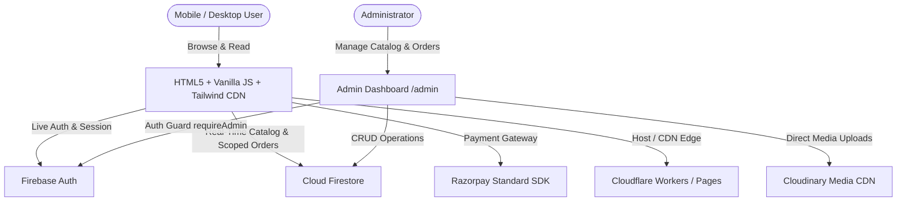

# 📚 Social Readers — Mission-Driven Bilingual E-Book & Audiobook Platform

> **Tagline:** "Read for Change." / "மாற்றத்திற்காக வாசிப்போம்."  
> **Mission:** 25% of every e-book and audiobook purchase is directly earmarked to fund student textbooks and grassroots rural sports equipment.

---

## 📑 Table of Contents
1. [Project Overview & Architecture](#-1-project-overview--architecture)
2. [Frontend to Backend Connection](#-2-frontend-to-backend-connection)
3. [Implemented Features](#-3-implemented-features)
4. [Firebase Auth & Admin Password Configuration](#-4-firebase-auth--admin-password-configuration)
5. [Cloudflare Deployment & API Keys Security](#-5-cloudflare-deployment--api-keys-security)
6. [Content Protection & Paid E-Book Access (DRM)](#-6-content-protection--paid-e-book-access-drm)
7. [Completed Tasks & Pending Production Roadmap](#-7-completed-tasks--pending-production-roadmap)
8. [Local Development & Deployment Commands](#-8-local-development--deployment-commands)

---

## 🏗️ 1. Project Overview & Architecture

Social Readers is built with a lightweight, high-performance, mobile-first JAMstack architecture requiring no heavy frontend build steps.



### 🛠️ Tech Stack Summary

| Layer | Technology | Details |
|---|---|---|
| **Frontend Markup** | Plain HTML5 | Semantic, accessible, optimized for mobile (80%+ user base) |
| **Styling** | Tailwind CSS (CDN) | Curated color palette (`#0B2C5D` Navy, `#2E7D32` Forest, `#E8720C` Orange) |
| **Application Logic** | Vanilla JavaScript (ES6+) | Clean modular scripts (`main.js`, `auth.js`, `checkout.js`, `reader.js`, `audio-player.js`, `cloudinary.js`) |
| **Authentication** | Firebase Auth | Email/Password login for both customers and store administrators |
| **Database** | Cloud Firestore | Real-time collections for `books`, `orders`, `stories`, `deals`, `categories`, `settings`, `admins` |
| **Media Hosting** | Cloudinary CDN | High-speed delivery of book covers, author portraits, audio samples, and documents |
| **Payments** | Razorpay Checkout SDK | Test Mode (`rzp_test_TWjICbE8TiyTnQ`) & Live Mode ready |
| **Deployment** | Cloudflare Pages / Workers | Global Edge delivery with HTTPS and zero-config caching |

---

## 🔌 2. Frontend to Backend Connection

### How Frontend Talks to Backend:
1. **Firebase SDK Integration:**
   - Public pages and admin pages load the official Google Firebase SDK via CDN (`firebase-app-compat.js`, `firebase-auth-compat.js`, `firebase-firestore-compat.js`).
   - `js/firebase-config.js` initializes the Firebase app and exposes `window.SocialReadersDB` with async and sync fallback caching.
2. **Graceful Offline Fallbacks:**
   - If Firestore network is slow or offline, `SocialReadersDB` seamlessly falls back to cached local catalog seed data, ensuring zero UI breakage for end users.
3. **Media CDN:**
   - Covers and assets upload directly to Cloudinary via unsigned REST API (`js/cloudinary.js`), returning secure `https://res.cloudinary.com/...` URLs.

---

## ✨ 3. Implemented Features

- ✅ **Bilingual Switcher (English & Tamil):** Instant client-side language switching across all pages with `js/i18n.js` and `localStorage` persistence.
- ✅ **2-Column Mobile-First Layout:** Standardized card frame ratio (`h-36 sm:h-48 md:h-52`, `aspect-[3/4]`), aligned button baselines, and touch-friendly horizontal swipe category rail.
- ✅ **Scoped Customer Account (`account.html`):**
  - **Orders Scoped Per User:** Logged-in users see *only* their purchases and receipts.
  - **Guest Mode:** Clean empty state prompting login to view library and download receipts.
  - **Personal 25% Impact Tracker:** Dynamically calculates total contribution, textbooks funded, and athletic shoes sponsored.
- ✅ **Audiobook Web Player (`js/audio-player.js`):** Sticky, floating bottom audio player with Play/Pause, 15s skip, progress scrub, and audio sample previews.
- ✅ **Interactive E-Book Reader (`js/reader.js`):** Clean reading modal with original chapter previews, dark mode toggle, font scaling (A- / A+), and progress bar.
- ✅ **Secure Checkout (`js/checkout.js`):** Real Razorpay checkout flow with dynamic pre-fill of logged-in user credentials and 25% transparent cause calculation.
- ✅ **Full Admin Suite (`admin/*.html`):** Protected by `requireAdmin()`. Real Firestore CRUD for Books, Categories, Stories, Lightning Deals, and Platform Settings.

---

## 🔐 4. Firebase Auth & Admin Password Configuration

### How Admin Authentication Works:
1. `SocialReadersAuth.loginAdmin(email, password)` verifies the credentials against **Firebase Auth**.
2. It then queries the Firestore `admins` collection (`admins/{uid}`) to verify the user has the `admin` role.
3. If valid, an encrypted session is saved to `localStorage` (`sr_admin_auth`).
4. All admin pages (`admin/*.html`) execute `SocialReadersAuth.requireAdmin()`, redirecting unauthorized users to `admin/login.html`.

### How to Change Admin Password in Firebase Console:
1. Open the [Firebase Console](https://console.firebase.google.com/).
2. Select project: **`e-book-7c31a`**.
3. Go to **Authentication** → **Users** tab.
4. Locate `admin@socialreaders.org` (or click **Add User** if creating a new administrator).
5. Click the three dots `⋮` on the right → Select **Reset Password** (or **Change Password**).
6. Enter your new strong admin password and click **Save**.

---

## 🌐 5. Cloudflare Deployment & API Keys Security

### Understanding Firebase Web Client API Keys:
In Google Firebase, web configuration parameters (`apiKey: "AIzaSy..."`, `projectId`, `authDomain`) are **client-side identifiers** meant to be executed by the browser. 

```javascript
// js/firebase-config.js
const firebaseConfig = {
  apiKey: "YOUR_FIREBASE_API_KEY",
  authDomain: "e-book-7c31a.firebaseapp.com",
  projectId: "e-book-7c31a",
  storageBucket: "e-book-7c31a.firebasestorage.app",
  messagingSenderId: "34774269799",
  appId: "1:34774269799:web:225f344859794de1a139c2",
  measurementId: "G-Y5HDMGDDPR"
};
```

### Best Practices to Lock Down & Secure Firebase:
1. **Google Cloud API Key Restrictions (Recommended):**
   - Go to [Google Cloud Console Credentials](https://console.cloud.google.com/apis/credentials).
   - Click your Firebase API key → Under **Application restrictions**, select **Websites (HTTP referrers)**.
   - Add your authorized domains:
     - `https://e-book.socialreadersin.workers.dev/*`
     - `https://socialreaders.org/*` (custom domain)
     - `http://localhost:*` (for local development)
   - Save changes. This ensures that even if someone copies your API key, it only executes from your website domain!

2. **Cloud Firestore Security Rules:**
   - In Firebase Console → **Firestore Database** → **Rules**, verify rules restrict writes:
     ```javascript
     rules_version = '2';
     service cloud.firestore {
       match /databases/{database}/documents {
         // Anyone can read books and stories
         match /books/{bookId} {
           allow read: if true;
           allow write: if request.auth != null;
         }
         match /stories/{storyId} {
           allow read: if true;
           allow write: if request.auth != null;
         }
         // Orders can only be read by the buyer or admin
         match /orders/{orderId} {
           allow create: if true;
           allow read: if request.auth != null;
           allow write: if request.auth != null;
         }
       }
     }
     ```

3. **Cloudflare Secrets (For Backend Worker APIs / Razorpay Secret):**
   - Keep your Razorpay Key Secret (`z6yPl1bxc...`) out of frontend files.
   - If using Cloudflare Workers backend functions, add secrets via CLI:
     ```bash
     npx wrangler secret put RAZORPAY_KEY_SECRET
     ```

---

## 🔒 6. Content Protection & Paid E-Book Access (DRM)

### How E-Book & Audiobook Access is Gated:

1. **Free Sample Preview vs Full Content:**
   - **Sample Mode (`Read Sample` / `Play Sample`):** Opens `js/reader.js` or `js/audio-player.js` with original introductory chapters (3-5 minute reading sample) for potential buyers.
   - **Paid Full Access (`My Library` in `account.html`):**
     - When a customer purchases a book, a completed order record is saved with `customerEmail`.
     - When the customer logs into `account.html`, the system matches `order.customerEmail === currentUser.email` and renders the **Read Full Book**, **Download PDF**, and **Listen Full Audiobook** action buttons.

2. **How to Protect Full E-Book Files (PDF/EPUB) from Public Leaks:**
   - **Step 1:** Upload full book PDF files to Cloudinary with `type: "authenticated"` or `type: "private"` (or private Firebase Storage bucket).
   - **Step 2:** Serve the full viewer through PDF.js Canvas renderer (which disables right-click copy and prevents raw direct URL sharing).

---

## 📋 7. Completed Tasks & Pending Production Roadmap

### ✅ Completed Tasks (Phases 1 & 2):
- [x] Full UI design with Amazon/Flipkart-style Category Rail and Hero Slider.
- [x] Mobile responsiveness unified across all 9 pages (2-column grids, matching frame ratios, no overflow).
- [x] Active mobile bottom navigation bar synced per page.
- [x] Firebase SDK & Firestore integration for books, orders, stories, deals, settings.
- [x] Cloudinary direct upload integration for admin cover/media management.
- [x] Scoped User Library and Order History (No demo data leaks).
- [x] Real Razorpay Standard Checkout SDK popup with 25% social share calculation.
- [x] Admin security guard (`requireAdmin()`) protecting all admin routes.
- [x] Fix Cloudflare deployment 404s by properly tracking `js/firebase-config.js`.

### ⏳ Pending Roadmap for Production Launch:
- [ ] **Full PDF Canvas Viewer (PDF.js):** Embed in-browser protected PDF reader that restricts raw downloads to verified order IDs.
- [ ] **Automated Order Receipt Emails:** Setup Firebase Cloud Function or Cloudflare Worker with SendGrid / Resend to automatically email PDF download links upon Razorpay webhook trigger.
- [ ] **Google Cloud API Key Domain Restriction:** Apply HTTP referrer domain restriction in Google Cloud Console.
- [ ] **Custom Domain Setup:** Map `socialreaders.org` or `store.socialreaders.org` in Cloudflare Dashboard.

---

## 💻 8. Local Development & Deployment Commands

### Run Locally:
```bash
# Using Python Simple Server:
python3 -m http.server 5500

# Or using Node http-server / Live Server:
npx http-server . -p 5500
```
Open browser at `http://127.0.0.1:5500/index.html`.

### Deploy to Cloudflare Pages / Workers:
```bash
git add .
git commit -m "docs: add comprehensive README covering architecture, auth, security & roadmap"
git push origin main
```
Cloudflare automatically builds and deploys the latest commit within seconds.

---

**Social Readers** — *Read for Change. Empowering youth education and grassroots sports talent.*
